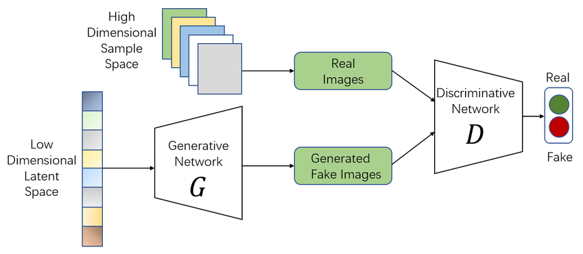

# 🚨 Fraud Data Generation using GANs  


  
  
  
  


---

## 📖 Overview  
Fraudulent transactions are **rare, sensitive, and difficult to collect** — making fraud detection a huge challenge in finance & banking.  

This project leverages **Generative Adversarial Networks (GANs)** 🤖 to **generate synthetic fraud data** that mimics real-world fraudulent transactions.  
👉 The synthetic data can be used to **train and test fraud detection models** more effectively.  

---

## 📊 Dataset  
We used the **[Credit Card Fraud Detection Dataset](https://www.kaggle.com/datasets/sowmyakuruba/credit-card-fraud-detection/data)** from Kaggle.  
- File included: `Creditcard_dataset.csv`  

---

## 🎯 Motivation  
- Fraud data is **highly imbalanced** (fraud cases are extremely rare).  
- GANs can **augment data** by generating realistic fraud samples.  
- Helps build **robust fraud detection models** with better generalization.  

---

## ⚙️ Requirements  
Make sure you have the following dependencies installed:  

```bash
Python >= 3.7
TensorFlow
Keras
NumPy
Pandas
Matplotlib
Scikit-learn
XGBoost
